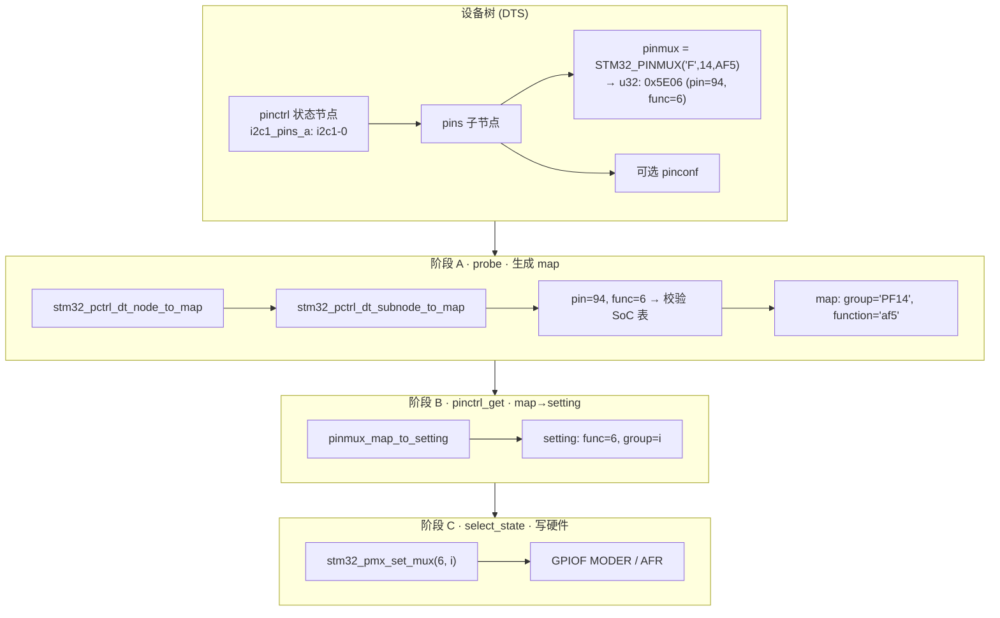
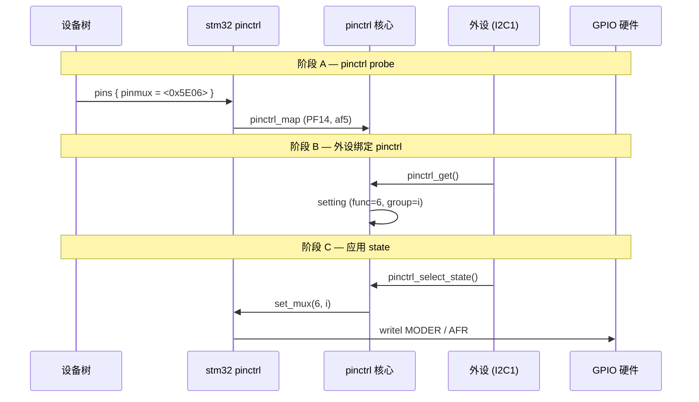
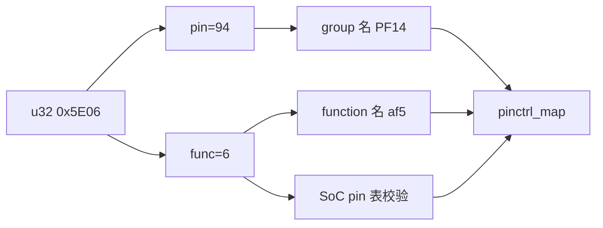
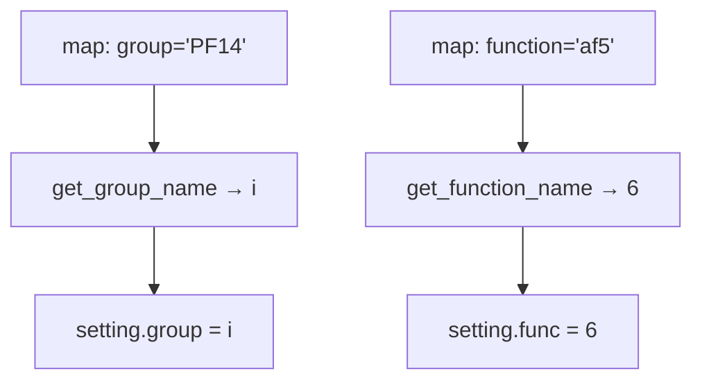
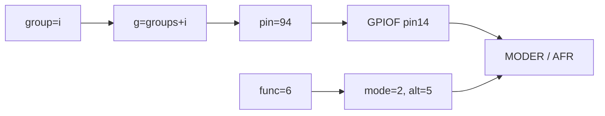

# STM32 Pinctrl：设备树解析与 set_mux

Linux 6.8 · `drivers/pinctrl/stm32/pinctrl-stm32.c`  
从设备树 `pinmux` 到 `stm32_pmx_set_mux` 写 GPIO 寄存器的完整路径。

---

## 目录

- [1. 总览](#1-总览)
- [2. 阶段 A：设备树 → pinctrl map](#2-阶段-a设备树--pinctrl-map)
- [3. 阶段 B：map → setting（字符串转数字）](#3-阶段-bmap--setting字符串转数字)
- [4. 阶段 C：set_mux 写硬件](#4-阶段-cset_mux-写硬件)
- [附录 A：源码索引](#附录-a源码索引)
- [附录 B：要点速记](#附录-b要点速记)

---

## 1. 总览

整条链路分 **三个阶段**，对应不同时机与数据形态：

| 阶段 | 时机 | 数据形态 | 关键函数 |
|:----:|------|----------|----------|
| **A** | pinctrl 驱动 probe | `u32` → 字符串 **map** | `stm32_pctrl_dt_subnode_to_map` |
| **B** | 外设 `pinctrl_get()` | 字符串 → **unsigned** setting | `pinmux_map_to_setting` |
| **C** | `pinctrl_select_state()` | 数字 → GPIO **寄存器** | `stm32_pmx_set_mux` |

示例：`STM32_PINMUX('F', 14, AF5)` → `0x5E06`（pin=94, func=6）→ map `("PF14","af5")` → setting `(6, i)` → 写 GPIOF MODER/AFR。

### 1.1 三阶段流程图



→ 阶段 A 详见 [§2](#2-阶段-a设备树--pinctrl-map)，阶段 B 详见 [§3](#3-阶段-bmap--setting字符串转数字)，阶段 C 详见 [§4](#4-阶段-cset_mux-写硬件)。

### 1.2 时序图



> **Mermaid 预览：** Cursor / VS Code Markdown 预览，或 [mermaid.live](https://mermaid.live)。

---

## 2. 阶段 A：设备树 → pinctrl map

### 2.1 设备树结构

```dts
i2c1_pins_a: i2c1-0 {
    pins {
        pinmux = <STM32_PINMUX('F', 14, AF5)>,
                 <STM32_PINMUX('F', 15, AF5)>;
        /* 可选: bias-pull-up, drive-open-drain, slew-rate */
    };
};
```

**调用链（阶段 A）：**

```
stm32_pctrl_dt_node_to_map()          // 遍历 i2c1-0 下 pins / pins1 ...
  └─ stm32_pctrl_dt_subnode_to_map()  // 解析单个 pins 子节点
       ├─ stm32_pctrl_dt_node_to_map_func()  // MUX map
       └─ pinctrl_utils_add_map_configs()    // 可选 CONFIG map
```

### 2.2 `STM32_PINMUX` 宏编码

`include/dt-bindings/pinctrl/stm32-pinfunc.h`：

```c
#define PIN_NO(port, line)  (((port) - 'A') * 0x10 + (line))
#define STM32_PINMUX(port, line, mode)  (((PIN_NO(port, line)) << 8) | (mode))
```

| 字段 | 宏 | 含义 |
|------|-----|------|
| 高字节 | `STM32_GET_PIN_NO(x)` → `(x)>>8` | 全局 pin 号 = `(port-'A')*16 + line` |
| 低字节 | `STM32_GET_PIN_FUNC(x)` → `(x)&0xff` | GPIO / AF0~15 / ANALOG |

| DT 宏 | 数值 | 驱动 `STM32_PIN_*` |
|-------|------|-------------------|
| `GPIO` | 0 | `STM32_PIN_GPIO` (0) |
| `AF0`…`AF15` | 1…16 | `STM32_PIN_AF(n)` = n+1 |
| `ANALOG` | 17 | `STM32_PIN_ANALOG` (18) |

**例：** `STM32_PINMUX('F', 14, AF5)` → pin **94**（`PF14`），func **6**，合成 **0x5E06**。

### 2.3 `stm32_pctrl_dt_subnode_to_map` 步骤

1. `of_find_property(node, "pinmux")`
2. `pinconf_generic_parse_dt_config()` — 可选 pull/slew 等
3. 循环每个 `u32`：`pin` / `func` 拆分 → `is_function_valid()` → `find_group_by_pin()`
4. 写 map：`group = grp->name`，`function = stm32_gpio_functions[func]`

生成的 **map 使用字符串**（`machine.h`）：

```c
struct pinctrl_map_mux {
    const char *group;      // "PF14"
    const char *function;   // "af5"
};
```

**注意：** DT 中 `AF5` 只表示复用功能 5；该脚在此 AF 上的具体信号名见各 SoC 的 `pinctrl-stm32*.c`（如 MP157 上 PF14 的 I2C1_SCL 在 **AF6**）。

### 2.4 单条 pinmux 解析示意



---

## 3. 阶段 B：map → setting（字符串转数字）

map 在 **外设 `pinctrl_get()`** 时由核心转为 **数字 selector**，存入 `pinctrl_setting`（`core.h`）：

```c
struct pinctrl_setting_mux {
    unsigned int group;   // groups[] 下标
    unsigned int func;    // stm32_gpio_functions[] 下标
};
```

**转换函数**（`drivers/pinctrl/pinmux.c` · `pinmux_map_to_setting`）：

| map 字符串 | 方法 | setting |
|------------|------|---------|
| `"af5"` | `pinmux_func_name_to_selector()` · `strcmp` + `get_function_name()` | `func = 6` |
| `"PF14"` | `pinctrl_get_group_selector()` · `strcmp` + `get_group_name()` | `group = i` |

应用 state 时调用：`ops->set_mux(pctldev, func, group)` — **不再使用字符串**。



### 3.1 `function`：下标 ↔ 字符串 ↔ 硬件

```c
static const char * const stm32_gpio_functions[] = {
    "gpio", "af0", "af1", ... "af15", "analog",
};
```

| selector | 字符串 | DT AF | 寄存器效果 |
|:--------:|--------|-------|------------|
| 0 | `gpio` | GPIO (0) | MODER=00 |
| 6 | `af5` | AF5 (6) | MODER=10, AFR=5 |
| 17 | `analog` | ANALOG (17) | MODER=11 |

`stm32_gpio_get_mode(6)→2`，`stm32_gpio_get_alt(6)→5`（`alt = function - 1`）。

### 3.2 `group`：下标 ↔ 字符串 ↔ pin 号

probe 时 **一 pin 一 group**（`stm32_pctrl_build_state`）：

```c
group->name = pin->pin.name;    // "PF14"
group->pin  = pin->pin.number;  // 94
```

| 概念 | 含义 |
|------|------|
| **group 字符串** | `groups[i].name` |
| **group selector** | `stm32_pmx_set_mux` 的 `group` 参数 = **`i`**（数组下标） |
| **全局 pin 号** | `groups[i].pin`（如 94），用于定位 bank |
| **bank 内偏移** | `pin % 16`（如 F14） |

group selector **常等于** pin 号（pin 表连续且无 package 过滤时），但语义是 **下标**；`st,package` 过滤后可能与 pin 号不一致。

---

## 4. 阶段 C：set_mux 写硬件

**调用链（阶段 C）：**

```
pinctrl_select_state()
  └─ pinmux_enable_setting()
       └─ stm32_pmx_set_mux(pctldev, func, group)
            └─ stm32_pmx_set_mode()  // MODER / AFR
```

### 4.1 `stm32_pmx_set_mux` 内部

```c
struct stm32_pinctrl_group *g = pctl->groups + group;
// g->name "PF14", g->pin 94
pin = stm32_gpio_pin(g->pin);           // 94 % 16 = 14
mode = stm32_gpio_get_mode(function);     // 6 → 2
alt  = stm32_gpio_get_alt(function);      // 6 → 5
// → bank GPIOF, 写 MODER、AFR
```



### 4.2 端到端数据对照（PF14 + AF5）

| 环节 | group | function | 备注 |
|------|-------|----------|------|
| DT `pinmux` | — | func 字节 = 6 | pin 字节 = 94 |
| map | `"PF14"` | `"af5"` | 字符串 |
| setting | `i` | `6` | unsigned |
| 硬件 | GPIOF:14 | AFR=5, MODER=复用 | `groups[i].pin` |

---

## 附录 A：源码索引

| 内容 | 路径 |
|------|------|
| DT 宏 | `include/dt-bindings/pinctrl/stm32-pinfunc.h` |
| pin/func 拆分 | `drivers/pinctrl/stm32/pinctrl-stm32.h` |
| DT 解析 | `pinctrl-stm32.c` — `stm32_pctrl_dt_subnode_to_map` |
| map 填写 | `pinctrl-stm32.c` — `stm32_pctrl_dt_node_to_map_func` |
| group 构建 | `pinctrl-stm32.c` — `stm32_pctrl_build_state` |
| 写硬件 | `pinctrl-stm32.c` — `stm32_pmx_set_mux` |
| map（字符串） | `include/linux/pinctrl/machine.h` |
| setting（数字） | `drivers/pinctrl/core.h` |
| 字符串→selector | `drivers/pinctrl/pinmux.c` — `pinmux_map_to_setting` |
| apply mux | `drivers/pinctrl/pinmux.c` — `pinmux_enable_setting` |
| SoC AF 表 | `drivers/pinctrl/stm32/pinctrl-stm32mp157.c` 等 |
| DT binding | `Documentation/devicetree/bindings/pinctrl/st,stm32-pinctrl.yaml` |

---

## 附录 B：要点速记

1. **`STM32_PINMUX`**：高字节 pin 号，低字节 func；与 `stm32_gpio_functions[]` 下标一致。
2. **阶段 A**：拆 `u32` → 校验 SoC 表 → 字符串 map（`PF14` / `af5`）。
3. **阶段 B**：`strcmp` 查表 → `pinctrl_setting` 数字 `(func, group)`。
4. **`function`**：`stm32_gpio_functions[selector]`；AFn → AFR 写入 n。
5. **`group`**：`groups[selector]`；`g->pin` 定位 bank，非 selector 本身。
6. **阶段 C**：`set_mux` 只认数字，写 MODER/AFR。
