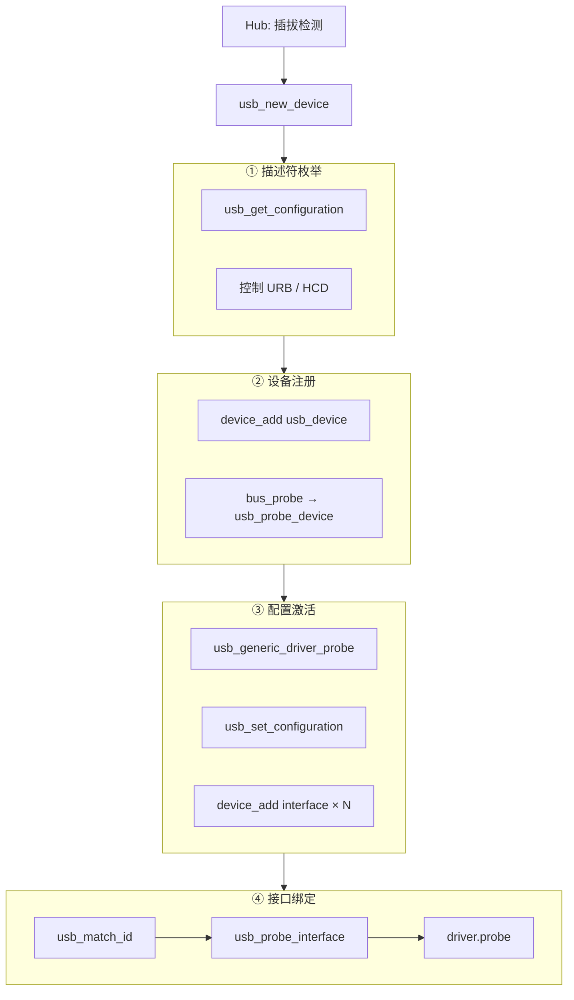
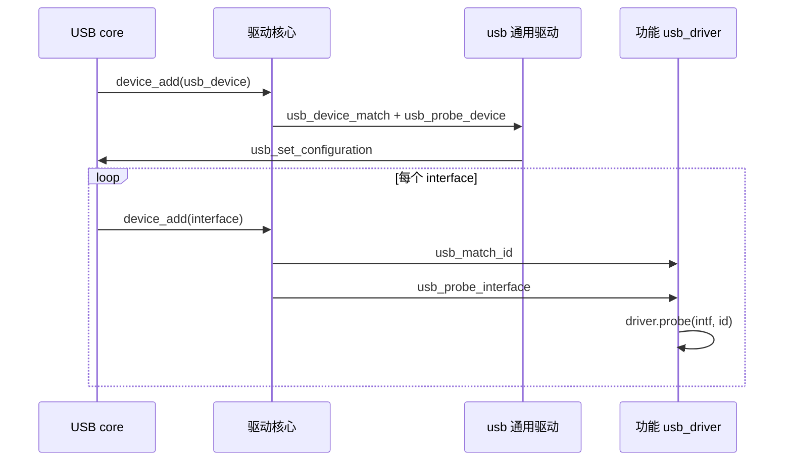
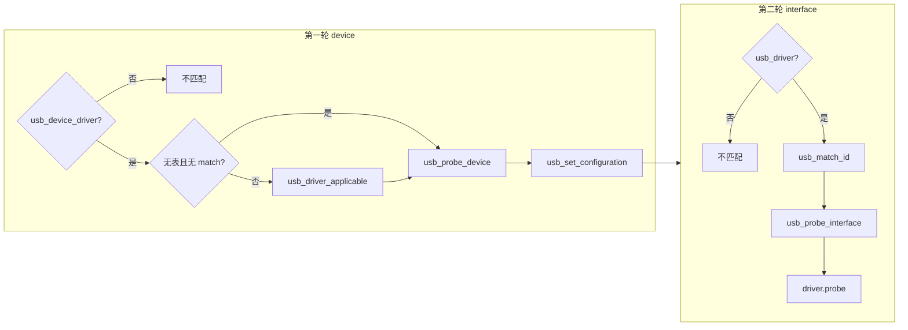

# USB 设备枚举与两轮 Probe

> Linux 6.8 · 源码路径 `drivers/usb/core/`

---

## 目录

1. [核心概念](#1-核心概念)
2. [四层流程（主线）](#2-四层流程主线)
3. [两轮 Probe 与匹配规则](#3-两轮-probe-与匹配规则)
4. [trace-cmd 跟踪](#4-trace-cmd-跟踪)
5. [源码索引](#5-源码索引)

---

## 1. 核心概念

### 1.1 两层内核对象

| 对象 | 驱动类型 | `probe` 包装 | 职责 |
|------|----------|--------------|------|
| `struct usb_device` | `usb_device_driver`（如 `usb`） | `usb_probe_device` | 整颗设备：选配置、`SET_CONFIGURATION` |
| `struct usb_interface` | `usb_driver`（如 `usb-storage`） | `usb_probe_interface` | 单个接口：功能驱动 `probe(intf, id)` |

二者挂在同一 `usb_bus_type` 上，由 `usb_device_match()` 根据节点类型分流，**互不交叉匹配**。

### 1.2 四个阶段（按职责划分）

| 阶段 | 要解决的问题 | USB / 内核状态 |
|------|--------------|----------------|
| **① 描述符枚举** | 设备有哪些 config / interface？ | ADDRESS，描述符在内存，未 CONFIGURED |
| **② 设备注册** | `usb_device` 如何进 sysfs / 总线？ | 出现 `2-x.x`，尚无 interface 设备节点 |
| **③ 配置激活** | 选哪个 configuration？ | CONFIGURED，`usb_interface` 创建并注册 |
| **④ 接口绑定** | 每个 interface 由谁驱动？ | 匹配 `usb_driver` 并执行功能驱动 probe |

**关系：** ①② 在 `usb_new_device()` 内完成；③④ 由第一轮 probe 里的 `usb_generic_driver` 触发。`usb_enumerate_device()` 为 static，逻辑主要体现在 ①（`usb_get_configuration` 等）。

---

## 2. 四层流程（主线）

### 2.1 端到端调用链

```text
[Hub] hub_irq → kick_hub_wq → hub_event → port_event
        → hub_port_connect → usb_new_device()
              │
              ├─ ① usb_enumerate_device()
              │     usb_get_configuration / usb_cache_string / quirks
              │
              ├─ ② device_add(&udev->dev)
              │     bus_probe_device → usb_device_match
              │     → really_probe → usb_probe_device
              │           → usb_generic_driver_probe
              │                 │
              │                 ├─ ③ usb_set_configuration()
              │                 │     SET_CONFIGURATION + HCD 端点
              │                 │     device_add(&intf->dev) × N
              │                 │           │
              │                 │           └─ ④ bus_probe → usb_match_id
              │                 │                 → usb_probe_interface
              │                 │                 → driver->probe(intf, id)
              │                 │
              │                 └─ usb_notify_add_device / ep0 sysfs …
              └─ 收尾
```

### 2.2 流程图



### 2.3 驱动核心路径（②③④ 共用）

`device_add()` 之后，device 与 interface 走同一套驱动核心流程，差异在 `usb_device_match()` 与 `driver.probe`：

```text
device_add()
  → bus_probe_device()
    → __device_attach() → bus_for_each_drv()
      → usb_device_match(dev, drv)    # 0=不匹配, 1=匹配
      → driver_probe_device()
        → really_probe()
          → drv->probe(dev)
               ├─ usb_device    → usb_probe_device
               └─ usb_interface → usb_probe_interface → driver->probe(intf, id)
```

注册时 probe 已绑定（`driver.c`）：

```c
usb_register_device_driver()  → driver.probe = usb_probe_device;
usb_register_driver()       → driver.probe = usb_probe_interface;
```

---

## 3. 两轮 Probe 与匹配规则

### 3.1 总览

| | 第一轮 | 第二轮 |
|---|--------|--------|
| **触发时机** | `device_add(usb_device)` 之后 | `usb_set_configuration()` 内每次 `device_add(intf)` 之后 |
| **对象** | `usb_device` | `usb_interface` |
| **驱动** | `usb_device_driver` | `usb_driver` |
| **匹配** | `usb_device_match` → `usb_driver_applicable` 等 | `usb_match_id` + `usb_match_dynamic_id` |
| **probe 入口** | `usb_probe_device` | `usb_probe_interface` |
| **典型工作** | 选配置、`usb_set_configuration` | `usb-storage` / `cdc_acm` / `hid` 等模块初始化 |

**顺序不可颠倒：** interface 设备节点由第一轮中的 `usb_set_configuration()` 创建；只有完成配置，才会进入第二轮匹配与 probe。



### 3.2 匹配总入口：`usb_device_match()`

```c
// drivers/usb/core/driver.c — 逻辑摘要
if (is_usb_device(dev)) {
    if (!is_usb_device_driver(drv)) return 0;
    /* device 级规则 */
} else if (is_usb_interface(dev)) {
    if (is_usb_device_driver(drv)) return 0;
    /* interface 级规则 */
}
return 0;
```

### 3.3 第一轮：device 匹配与 probe

| 条件 | 匹配结果 |
|------|----------|
| 无 `id_table` 且无 `match` | 返回 **1**，由 `probe()` 决定是否绑定 |
| 有 `id_table` / `match` | `usb_driver_applicable()` |

`usb_driver_applicable()`：

| 驱动提供 | 需满足 |
|----------|--------|
| `id_table` + `match` | 两者都通过 |
| 仅 `id_table` | `usb_device_match_id()` 命中（VID/PID、bcdDevice、设备 class） |
| 仅 `match` | `match(udev) == true` |

**`usb` 通用驱动**（`generic.c`，仅 `.match`）：

1. `udev->use_generic_driver` → 匹配；
2. 若其它 `usb_device_driver` 的 `usb_driver_applicable()` 为真 → generic 不匹配；
3. 否则 → generic 兜底。

匹配成功后调用 `usb_probe_device()` → 通常进入 `usb_generic_driver_probe()` → `usb_choose_configuration()` + `usb_set_configuration()`。match 在 attach 阶段已完成，probe 内不再重复匹配。

### 3.4 第二轮：interface 匹配与 probe

| 顺序 | 函数 | 说明 |
|------|------|------|
| attach | `usb_match_id` → `usb_match_dynamic_id` | 在 `usb_device_match()` 中判断是否绑定该 `usb_driver` |
| probe | `usb_probe_interface()` | 先 `usb_match_dynamic_id`，再 `usb_match_id`；得到 `id` 后调 `driver->probe(intf, id)` |

**`usb_match_one_id()`** 需同时满足设备字段与接口字段：

```c
usb_match_device(dev, id) && usb_match_one_id_intf(dev, intf, id);
```

常用 `match_flags`（`mod_devicetable.h`）：`VENDOR`、`PRODUCT`、`DEV_CLASS`、`INT_CLASS`、`INT_NUMBER` 等。

**注意：** 设备 `bDeviceClass == USB_CLASS_VENDOR_SPEC` 时，若表项未指定 `MATCH_VENDOR` 却匹配接口 class，内核会故意判为不匹配。

### 3.5 两轮对照（速查）

| 项目 | 第一轮 | 第二轮 |
|------|--------|--------|
| 匹配函数 | `usb_driver_applicable` / 无条件通过 | `usb_match_id` + dynamic |
| id 表侧重 | VID/PID、设备 class | 可加 interface class/number |
| 兜底驱动 | `usb_generic_driver` | 无（无匹配则 interface 无驱动） |
| probe 之后 | `SET_CONFIGURATION`、注册 interface | 模块 `probe(intf, id)` |



---

## 4. trace-cmd 跟踪

可用 function graph 从 `usb_new_device` 或 `usb_set_configuration` 观察上述调用链：

```bash
sudo trace-cmd reset
sudo trace-cmd record -p function_graph \
  -g usb_new_device --max-graph-depth 64 -o /tmp/usb.dat
# 插拔设备后停止
sudo trace-cmd report /tmp/usb.dat -F function_graph | less
```

| 目的 | 建议 |
|------|------|
| 查看完整子调用树 | `-g usb_new_device` |
| `usb_get_descriptor` 调用链说明 | [usb-get-descriptor-trace.md](usb-get-descriptor-trace.md) |
| 关注配置与接口注册 | `-g usb_set_configuration` |
| 跟踪接口驱动绑定 | `-l usb_probe_interface` |
| 带内核栈 | 录制时加 `--stack` |

`usb_enumerate_device` 为 static，trace 中通常体现为 `usb_get_configuration` 等子函数；若 kallsyms 无符号，可对 `usb_new_device` 设 graph 根。

---

## 5. 源码索引

| 文件 | 关键点 |
|------|--------|
| `drivers/usb/core/hub.c` | `hub_irq`、`hub_event`、`usb_new_device`、`usb_enumerate_device` |
| `drivers/usb/core/message.c` | `usb_set_configuration` |
| `drivers/usb/core/generic.c` | `usb_generic_driver`、`usb_generic_driver_match` |
| `drivers/usb/core/driver.c` | `usb_device_match`、`usb_probe_*`、`usb_match_*` |
| `drivers/base/core.c` | `device_add`、`bus_probe_device` |
| `drivers/base/dd.c` | `really_probe`、`driver_probe_device` |
| `include/linux/mod_devicetable.h` | `struct usb_device_id` |

---

## 附录：关键代码锚点

```c
/* hub.c — usb_new_device */
usb_enumerate_device(udev);
device_add(&udev->dev);              /* ② 触发第一轮 probe */

/* generic.c — usb_generic_driver_probe */
usb_choose_configuration(udev);
usb_set_configuration(udev, c);      /* ③④ */

/* message.c — usb_set_configuration */
for (i = 0; i < nintf; ++i)
    device_add(&intf->dev);          /* 触发第二轮 probe */

/* driver.c — usb_probe_interface */
id = usb_match_id(intf, driver->id_table);
driver->probe(intf, id);
```

---

*Linux 6.8*
