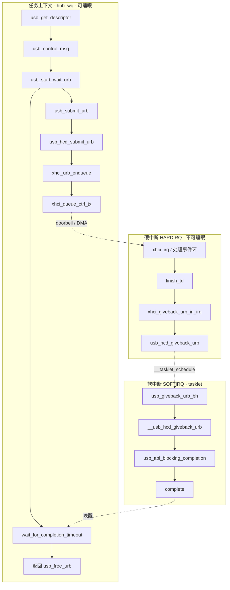

# `usb_get_descriptor` 调用链

> Linux 6.8 · `drivers/usb/core/message.c`  
> 关联文档：[USB 协议枚举](usb_enumeration.md) · [内核枚举与 Probe](usb-enumeration-and-probe.md) · [`hub_port_init`](usb-hub-port-init.md)

---

## 目录

1. [一次完整调用栈](#1-一次完整调用栈)
2. [要点说明](#2-要点说明)
3. [源码索引](#3-源码索引)

---

## 1. 一次完整调用栈

Hub `hub_wq` 线程等对**普通外设**（非 Root Hub）发起 GET_DESCRIPTOR 时（此前由 [`hub_port_init`](usb-hub-port-init.md) 完成地址与 EP0 包长），单次调用从 core 到 xHCI 再返回的大致路径如下（省略 `kmalloc`、`__cond_resched` 等噪声）。

### 1.1 向下：提交 URB（任务上下文 · 可睡眠）

```text
usb_get_descriptor()                          message.c
  └── usb_control_msg()
        └── usb_internal_control_msg()
              ├── usb_fill_control_urb(..., usb_api_blocking_completion, ...)
              └── usb_start_wait_urb()
                    ├── usb_submit_urb()
                    │     └── usb_hcd_submit_urb()              hcd.c
                    │           ├── map_urb_for_dma()
                    │           │     └── xhci_map_urb_for_dma() → usb_hcd_map_urb_for_dma()
                    │           └── hcd->driver->urb_enqueue()
                    │                 └── xhci_urb_enqueue()      xhci.c
                    │                       └── xhci_queue_ctrl_tx()   xhci-ring.c
                    │                             ├── prepare_transfer / queue_trb × N
                    │                             └── xhci_ring_ep_doorbell()
                    └── wait_for_completion_timeout()             ← 阻塞，等待传输完成
```

### 1.2 向上：完成并返回

```text
【硬中断 HARDIRQ】
  xhci_irq / 事件环
    └── finish_td()
          └── xhci_giveback_urb_in_irq()
                ├── usb_hcd_unlink_urb_from_ep()
                └── usb_hcd_giveback_urb()              ← 仅 __tasklet_schedule，不在此调 complete

【软中断 SOFTIRQ · tasklet】
  usb_giveback_urb_bh()
    └── __usb_hcd_giveback_urb()
          ├── unmap_urb_for_dma() / xhci_unmap_urb_for_dma()
          └── urb->complete(urb)
                └── usb_api_blocking_completion()
                      └── complete(&ctx->done)

【任务上下文 · 同一线程被唤醒】
  wait_for_completion_timeout() 返回
    └── usb_free_urb()
          └── usb_control_msg() / usb_get_descriptor() 返回
```

### 1.3 流程图



**上下文对照**

| 阶段 | 典型执行上下文 | 说明 |
|------|----------------|------|
| 提交 URB | 任务上下文（Hub `kworker` / `hub_wq`） | 可调用 `usb_control_msg`、可 `schedule` 睡眠 |
| xHCI 收 completion | **硬中断** | 解析事件环、`finish_td`；`giveback_urb` 只排队 tasklet |
| 调 `urb->complete` | **软中断**（`usb_giveback_urb_bh`） | xHCI 设 `HCD_BH`；`complete()` 不可睡眠 |
| 唤醒后继续 | 任务上下文 | `wait_for_completion_timeout` 返回，释放 URB |

---

## 2. 要点说明

### 2.1 同步 API 与回调

`usb_get_descriptor()` 通过 `usb_control_msg()` 走同步路径：每次请求分配一个 URB，在 `usb_start_wait_urb()` 里提交并等待。

```35:41:drivers/usb/core/message.c
static void usb_api_blocking_completion(struct urb *urb)
{
	struct api_context *ctx = urb->context;

	ctx->status = urb->status;
	complete(&ctx->done);
}
```

提交前 `urb->context = &ctx`（栈上 `struct api_context`）；**硬中断里不调用** `urb->complete`，仅在 **tasklet（软中断）** 中经 `__usb_hcd_giveback_urb()` 调用，`complete()` 再唤醒仍在 `wait_for_completion_timeout()` 中的 Hub 工作线程。

### 2.2 `usb_hcd_submit_urb` 分支

```1530:1538:drivers/usb/core/hcd.c
	if (is_root_hub(urb->dev)) {
		status = rh_urb_enqueue(hcd, urb);
	} else {
		status = map_urb_for_dma(hcd, urb, mem_flags);
		if (likely(status == 0))
			status = hcd->driver->urb_enqueue(hcd, urb, mem_flags);
```

枚举时访问 **Hub 下游外设** → `is_root_hub()` 为假 → **`xhci_urb_enqueue()`**，不走 `rh_urb_enqueue()`。

### 2.3 硬中断与软中断的分工

| 上下文 | 函数 | 做什么 |
|--------|------|--------|
| **硬中断** | `xhci_giveback_urb_in_irq()` | 从端点队列摘下 URB，调 `usb_hcd_giveback_urb()` |
| **硬中断** | `usb_hcd_giveback_urb()` | 把 URB 挂到 `giveback_urb_bh` 链表并 `__tasklet_schedule()`，**立即返回** |
| **软中断** | `usb_giveback_urb_bh()` → `__usb_hcd_giveback_urb()` | DMA 解映射、调用 `urb->complete()` |

xHCI 主机控制器带 `HCD_BH`；对普通外设不走在中断里直接 `complete` 的路径，是为遵守「completion 在 tasklet / 进程上下文执行、且不可睡眠」的约定。

### 2.4 与协议、其它入口

| 层次 | 内容 |
|------|------|
| USB 协议 | 标准 GET_DESCRIPTOR 控制传输（SETUP + IN 数据 + 状态阶段） |
| 不经 `usb_get_descriptor` 的同类请求 | 如 `hub_port_init()` 中读 8 字节 `bMaxPacketSize0` 直接调用 `usb_control_msg()`（`hub.c` `get_bMaxPacketSize0()`） |

---

## 3. 源码索引

| 文件 | 函数 |
|------|------|
| `drivers/usb/core/message.c` | `usb_get_descriptor`、`usb_control_msg`、`usb_start_wait_urb`、`usb_api_blocking_completion` |
| `drivers/usb/core/hcd.c` | `usb_hcd_submit_urb`、`usb_hcd_giveback_urb`、`usb_giveback_urb_bh` |
| `drivers/usb/host/xhci.c` | `xhci_urb_enqueue` |
| `drivers/usb/host/xhci-ring.c` | `xhci_queue_ctrl_tx`、`xhci_giveback_urb_in_irq` |

---

*Linux 6.8*
