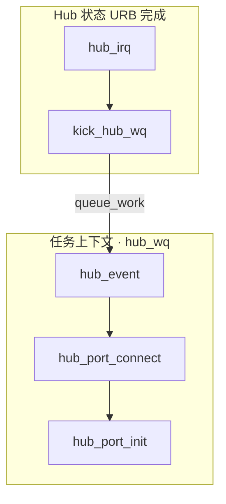
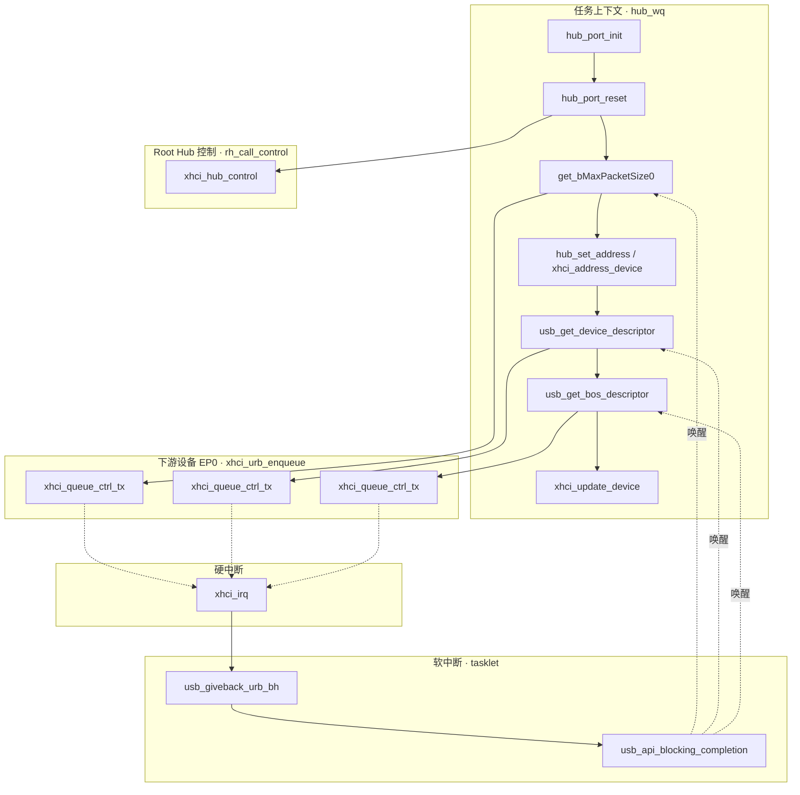

# `hub_port_init` 调用链

> Linux 6.8 · `drivers/usb/core/hub.c`  
> 关联文档：[USB 协议枚举](usb_enumeration.md) · [内核枚举与 Probe](usb-enumeration-and-probe.md) · [`usb_get_descriptor` 调用链](usb-get-descriptor-trace.md)

---

## 目录

1. [从插盘到 `hub_port_init`](#1-从插盘到-hub_port_init)
2. [`hub_port_init` 内部分阶段](#2-hub_port_init-内部分阶段)
3. [两类控制传输路径](#3-两类控制传输路径)
4. [与协议步骤对照](#4-与协议步骤对照)
5. [要点说明](#5-要点说明)
6. [源码索引](#6-源码索引)

---

## 1. 从插盘到 `hub_port_init`

枚举**由中断牵起**，但 **`hub_port_init()` 在 Hub 工作队列线程里执行**（`hub_wq` 的 `kworker`，可睡眠），不在硬中断里直接跑。

```text
【Hub 中断 URB 完成 · 多在软中断/tasklet】
  hub_irq()                              hub.c
    └── kick_hub_wq()
          └── queue_work(hub_wq, hub_event)

【任务上下文 · hub_wq】
  hub_event()
    └── hub_port_connect_change() / port_event
          └── hub_port_connect()
                ├── usb_alloc_dev()、choose_devnum()
                └── hub_port_init()              ← 本文
                      └── 成功后 hub_port_connect 继续
                            └── usb_new_device() …（见 probe 文档）
```



---

## 2. `hub_port_init` 内部分阶段

`hub_port_init(hub, udev, port1, retry_counter, dev_descr)` 在**地址 0 / DEFAULT 状态**下，完成端口复位、分配地址、读设备描述符与 BOS，最后通知 HCD。单次插盘在 **`hub_wq` 线程内**跑完（与 `usb_get_descriptor` 文档中的执行上下文一致）。

### 2.1 总览调用栈（精简）

```text
hub_port_init()                                    hub.c
  ├── hub_port_reset()
  │     └── hub_ext_port_status() / set/clear port feature
  │           └── usb_control_msg() → 父 Hub（Root Hub）
  │                 └── rh_call_control() → xhci_hub_control()
  │
  ├── [循环] GET_DESCRIPTOR / SET_ADDRESS（见 §2.2、源码 4935–5037 行）
  │     ├── hub_enable_device()          （新方案 SuperSpeed 时）
  │     ├── get_bMaxPacketSize0()        → usb_control_msg → xhci_urb_enqueue
  │     ├── hub_set_address()
  │     │     └── xhci_address_device()  （xHCI 常见）或 usb_control_msg(SET_ADDRESS)
  │     └── msleep(10) 等
  │
  ├── usb_get_device_descriptor()
  │     └── usb_get_descriptor(DEVICE)   → xhci_urb_enqueue
  │
  ├── usb_detect_quirks()
  ├── usb_get_bos_descriptor()           （bcdUSB ≥ 0x0201）
  │     └── usb_get_descriptor(BOS) × 2
  │
  └── hcd->driver->update_device()       （如 xhci_update_device）
```

### 2.2 分阶段说明

| 阶段 | 主要函数 | 控制传输对象 | 典型 HCD 路径 |
|------|----------|--------------|---------------|
| **A. 端口复位** | `hub_port_reset` | **父 Hub**（Root Hub）端口特性 | `rh_call_control` → `xhci_hub_control` |
| **B. 知 EP0 包长** | `get_bMaxPacketSize0` | **下游设备** EP0 @ 地址 0 | `xhci_urb_enqueue` → `xhci_queue_ctrl_tx` |
| **C. 分配地址** | `hub_set_address` | 设备（SS 常走 HCD 专用入口） | `xhci_address_device` 或 `usb_control_msg` |
| **D. SS 辅助** | `usb_set_isoch_delay` 等 | 下游设备 | `xhci_urb_enqueue` |
| **E. 完整设备描述符** | `usb_get_device_descriptor` | 下游设备（已 ADDRESS） | `usb_get_descriptor` → `xhci_urb_enqueue` |
| **F. BOS** | `usb_get_bos_descriptor` | 下游设备 | `usb_get_descriptor` × 2 |
| **G. 通知 HCD** | `xhci_update_device` | — | 无 URB |

阶段 B 与 [usb_enumeration.md](usb_enumeration.md) 中 **① GET_DESCRIPTOR（8 字节或新方案更长）**、**② SET_ADDRESS** 对应；阶段 E 对应 **③ 完整 DEVICE**。

**旧方案 vs 新方案**（`use_new_scheme()`）：

- **旧方案**：先 `SET_ADDRESS`，再 `get_bMaxPacketSize0(..., 8)`（**不经过** `usb_get_descriptor()`）。
- **新方案**（Windows 式，SuperSpeed 常见）：先较长 GET_DESCRIPTOR，再 reset / `SET_ADDRESS`。

### 2.3 下游设备一次 GET_DESCRIPTOR（与 giveback 上下文）

与 [`usb-get-descriptor-trace.md`](usb-get-descriptor-trace.md) 相同模板：

```text
【任务上下文】
  get_bMaxPacketSize0 / usb_get_descriptor
    └── usb_control_msg → usb_start_wait_urb → xhci_urb_enqueue
    └── wait_for_completion_timeout()

【硬中断】xhci_irq → finish_td → xhci_giveback_urb_in_irq → usb_hcd_giveback_urb

【软中断】usb_giveback_urb_bh → usb_api_blocking_completion → complete()

【任务上下文】wait 返回，继续 hub_port_init
```

### 2.4 流程图（阶段 + 上下文）



---

## 3. 两类控制传输路径

| 目标 | `urb->dev` | `usb_hcd_submit_urb` 分支 | 本场景用途 |
|------|------------|---------------------------|------------|
| **父 Hub / Root Hub** | Hub 的 `usb_device`（`is_root_hub` 或 Hub 类请求） | **`rh_urb_enqueue` → `rh_call_control` → `xhci_hub_control`** | 端口复位、读/清端口状态、`SET_FEATURE` |
| **下游外设 EP0** | 正在枚举的 `udev` | **`xhci_urb_enqueue` → `xhci_queue_ctrl_tx`** | GET_DESCRIPTOR、SET_ADDRESS（非专用 HCD 路径时）、BOS |

```1530:1538:drivers/usb/core/hcd.c
	if (is_root_hub(urb->dev)) {
		status = rh_urb_enqueue(hcd, urb);
	} else {
		status = map_urb_for_dma(hcd, urb, mem_flags);
		if (likely(status == 0))
			status = hcd->driver->urb_enqueue(hcd, urb, mem_flags);
```

**8 字节设备描述符**在旧方案里由 `get_bMaxPacketSize0()` 直接 `usb_control_msg()` 完成，逻辑同 GET_DESCRIPTOR，但**函数名不是** `usb_get_descriptor()`（见 `hub.c` 4768 行）。

---

## 4. 与协议步骤对照

| [usb_enumeration.md](usb_enumeration.md) | `hub_port_init` 内 |
|----------------------------------------|-------------------|
| 总线复位 / 速度协商 | `hub_port_reset` + Hub 端口状态 |
| ① GET_DESCRIPTOR DEVICE（8 字节） | `get_bMaxPacketSize0`（旧方案；新方案可能先读更长） |
| ② SET_ADDRESS | `hub_set_address` / `xhci_address_device` |
| ③ GET_DESCRIPTOR DEVICE（完整） | `usb_get_device_descriptor` |
| ④ GET_DESCRIPTOR CONFIG | **不在** `hub_port_init`；在后续 `usb_new_device` → `usb_get_configuration` |
| BOS（USB 3.x） | `usb_get_bos_descriptor` |

`hub_port_init` 返回成功后，`hub_port_connect` 才调用 **`usb_new_device()`**，进入 [usb-enumeration-and-probe.md](usb-enumeration-and-probe.md) 中的 `usb_enumerate_device` / 两轮 probe。

---

## 5. 要点说明

### 5.1 职责边界

- **`hub_port_init`**：端口级、**DEFAULT → ADDRESS**，设备描述符进 `udev->descriptor`，可选 BOS。
- **`usb_new_device` / `usb_get_configuration`**：总线级注册、读配置描述符、`SET_CONFIGURATION`、interface probe。

### 5.2 `hub_set_address` 与 xHCI

SuperSpeed 设备上，`hub_set_address()` 常走 HCD 的 **`address_device`**，而不是普通的 `usb_control_msg(SET_ADDRESS)`：

```4684:4689:drivers/usb/core/hub.c
	if (hcd->driver->address_device)
		retval = hcd->driver->address_device(hcd, udev, timeout_ms);
	else
		retval = usb_control_msg(udev, usb_sndaddr0pipe(),
				USB_REQ_SET_ADDRESS, 0, devnum, 0,
				NULL, 0, timeout_ms);
```

### 5.3 成功后收尾

```5132:5135:drivers/usb/core/hub.c
	retval = 0;
	/* notify HCD that we have a device connected and addressed */
	if (hcd->driver->update_device)
		hcd->driver->update_device(hcd, udev);
```

---

## 6. 源码索引

| 文件 | 函数 / 说明 |
|------|-------------|
| `drivers/usb/core/hub.c` | `hub_irq`、`kick_hub_wq`、`hub_event`、`hub_port_connect`、`hub_port_init` |
| `drivers/usb/core/hub.c` | `get_bMaxPacketSize0`、`hub_set_address`、`hub_port_reset` |
| `drivers/usb/core/message.c` | `usb_get_device_descriptor`、`usb_control_msg` |
| `drivers/usb/core/config.c` | `usb_get_bos_descriptor` |
| `drivers/usb/core/hcd.c` | `rh_urb_enqueue`、`usb_hcd_submit_urb` |
| `drivers/usb/host/xhci.c` | `xhci_hub_control`、`xhci_address_device`、`xhci_urb_enqueue` |
| `drivers/usb/host/xhci-ring.c` | `xhci_queue_ctrl_tx`、`xhci_giveback_urb_in_irq` |

---

*Linux 6.8*
