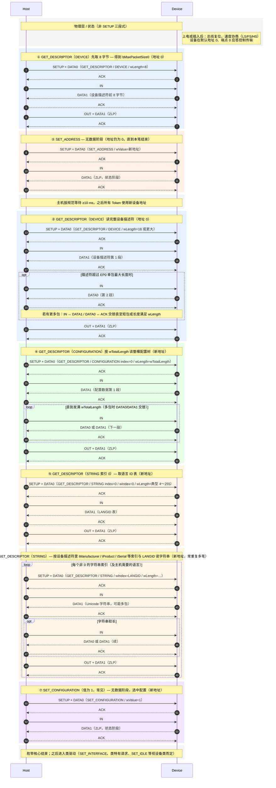

# USB 2.0 典型枚举流程（Token / DATA0·DATA1 / ACK，不含 NAK）

参与者为 **Host** 与 **Device**。每笔控制传输均符合规范中的 SETUP、可选数据阶段、状态阶段；**GET_DESCRIPTOR** 类请求的数据阶段为 **IN**，状态为 **OUT + DATA1(ZLP)**；**SET_ADDRESS** / **SET_CONFIGURATION** 无数据阶段，状态阶段为 **IN + 设备 DATA1(ZLP)**。

# 抓包文件

[[files/usb.pcapng|U 盘枚举及传输抓包文件]]

## 说明

- **未体现**：`GET_STATUS`、`SET_INTERFACE`、HID `SET_IDLE`、MS OS 描述符、高速 Split 等；均为同类控制传输或总线扩展事务，可接在 **SET_CONFIGURATION** 前后。

